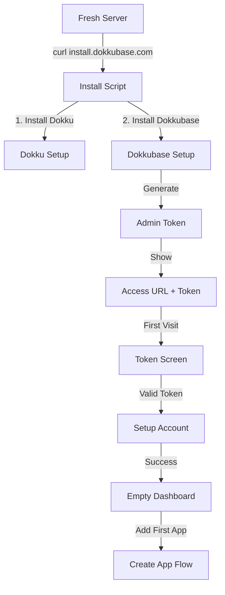
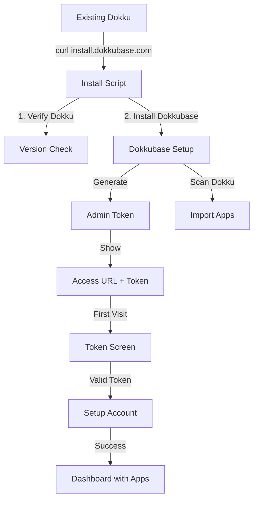
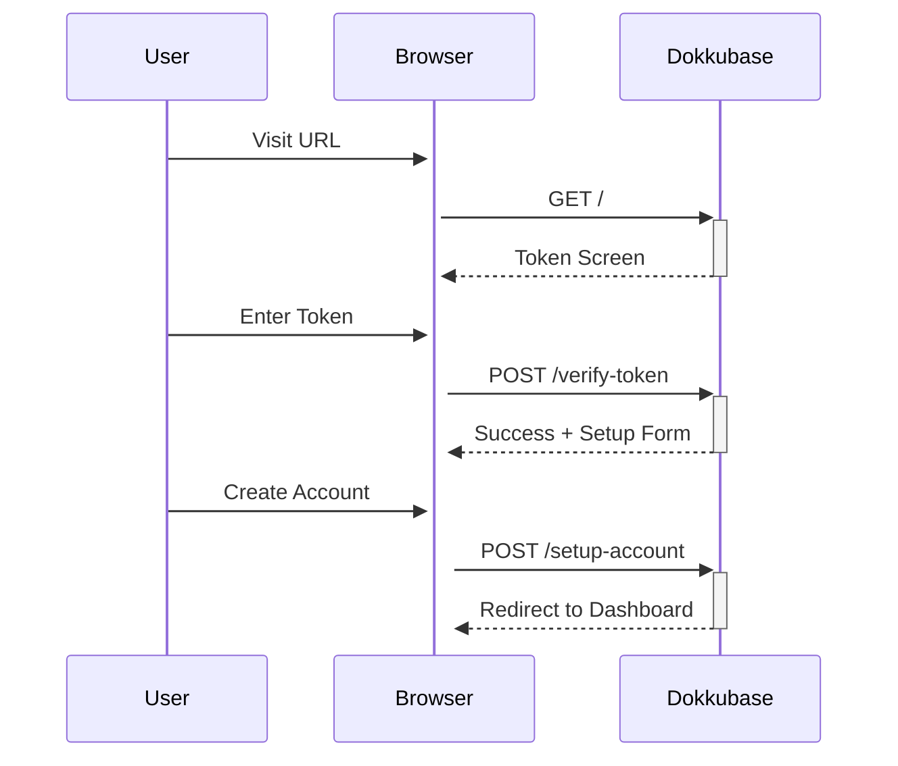
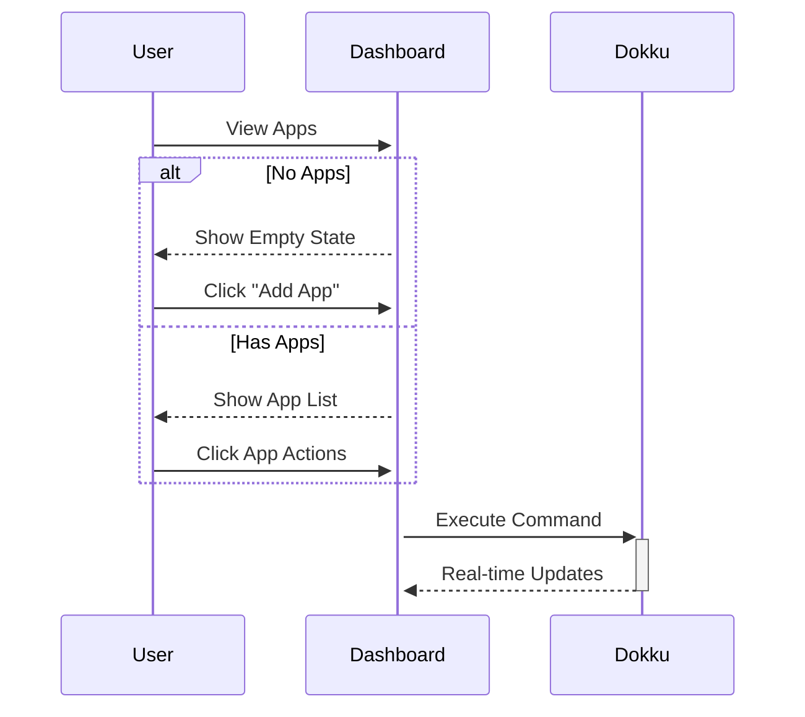
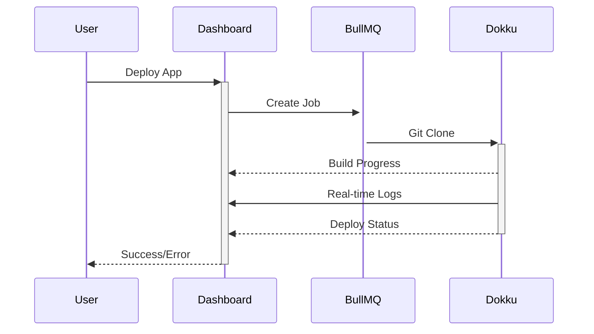

# 🚀 Dokkubase - User Flows

## Installation Scenarios

### Scenario A: Fresh Server
Użytkownik instaluje Dokku + Dokkubase na świeżym serwerze.

### Scenario B: Existing Dokku
Użytkownik dodaje Dokkubase do istniejącego serwera z Dokku.

## Core Flows

### 1. First Access Flow

### 2. App Management Flow

### 3. Deployment Flow

## Key Differences

### Fresh Server (Scenario A)
- Empty state with guided setup
- First app creation wizard
- Basic Dokku configuration
- Default settings

### Existing Server (Scenario B)
- Import existing apps
- Preserve configurations
- Show current status
- Respect custom settings

## Implementation Priority

1. **Phase 1 (Current)**
   - Basic auth flow ✅
   - Token validation
   - Account setup
   - Simple dashboard

2. **Phase 2**
   - App import logic
   - Existing apps detection
   - Configuration preservation
   - Status scanning

3. **Phase 3**
   - Advanced features
   - Custom domains
   - SSL management
   - Advanced monitoring
